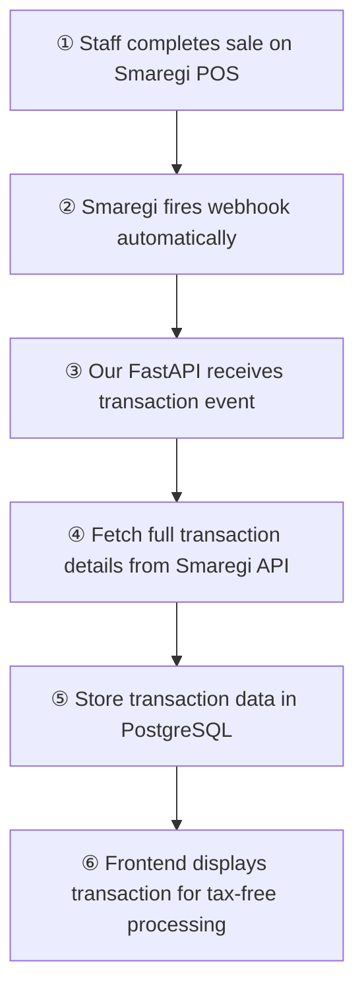
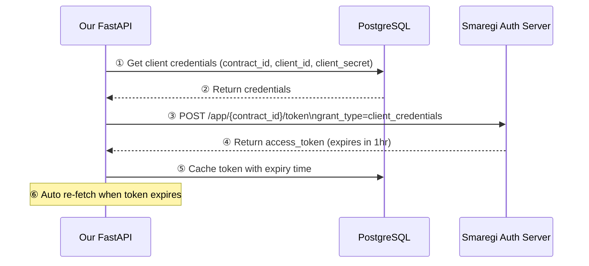
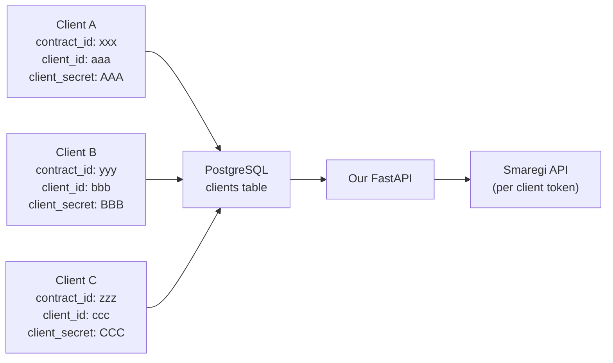

# Smaregi POS Integration — Complete Guide

## Overview

This guide explains how we integrated Smaregi POS data into our tax-free system, why we made certain decisions, and how to onboard new clients.

---

## How It Works



---

## Auth Flow



---

## Multi-Client Flow



---

## Project Structure

```
smaregi-multi-client/
├── Dockerfile
├── docker-compose.yml
├── requirements.txt
├── .env
├── main.py
├── config.py
├── auth/
│   └── smaregi_auth.py       # Token fetch + cache + auto-refresh per client
├── db/
│   └── database.py           # PostgreSQL connection + table setup
├── routes/
│   ├── clients.py            # Add/list/delete client credentials
│   ├── transactions.py       # Fetch transactions per client
│   └── webhook.py            # Receive real-time webhook from Smaregi
└── services/
```

---

## API Endpoints

| Method | Endpoint | Description |
|--------|----------|-------------|
| `POST` | `/clients/` | Add new client credentials |
| `GET` | `/clients/` | List all registered clients |
| `DELETE` | `/clients/{contract_id}` | Remove a client |
| `GET` | `/transactions/{contract_id}` | Fetch today's transactions for a client |
| `GET` | `/transactions/{contract_id}/{transaction_id}` | Fetch single transaction with details |
| `POST` | `/webhook/transaction` | Receive real-time transaction from Smaregi |
| `GET` | `/webhook/transactions/{contract_id}` | Get webhook transactions per client |

---

## Step 1 — Smaregi Developer Account Setup

Go to [https://developers.smaregi.dev](https://developers.smaregi.dev) and register.

Note your **Contract ID** from the top-left of the dashboard (format: `sb_xxxx` for sandbox).

---

## Step 2 — Register Private App

Go to **Application → Private App → New Registration**

| Field | Value |
|-------|-------|
| **App division** | `WEB App` |
| **App name** | Your app name |
| **Icon** | Upload any image (512×512px, max 1MB) |

Click **Register**.

---

## Step 3 — Set Scopes

Go to **Scope** tab and enable:

- `pos.transactions:read`
- `pos.products:read`
- `pos.stores:read`

Click **Save**.

---

## Step 4 — Environment Settings ⚠️ Requires public URL

> You need ngrok running before filling this in. See Step 6.

| Field | Value |
|-------|-------|
| **App URL** | `https://your-ngrok-url.ngrok-free.app` |
| **URL of user contract notification destination** | `https://your-ngrok-url.ngrok-free.app/contract` |
| **Webhook destination endpoint** | `https://your-ngrok-url.ngrok-free.app/webhook/transaction` |
| **Redirect URI** | Leave as is |

Also save:
- **Client ID** → copy from this page
- **Client Secret** → click 👁 to reveal, copy immediately (shown once only)
- **Contract ID** → top-left of dashboard

---

## Step 5 — Enable Webhook

Go to **Webhook** tab:

- Toggle **Using webhook** → **Enabled**
- Scroll down and enable **取引 (transactions)** event
- Click **Save**

---

## Step 6 — Setup Backend

### Fill .env

```env
SMAREGI_AUTH_BASE_URL=https://id.smaregi.dev
SMAREGI_API_BASE_URL=https://api.smaregi.dev
DATABASE_URL=postgresql://postgres:postgres@db:5432/smaregi
APP_PORT=8000
```

### Run with Docker

```bash
docker-compose up --build
```

Confirm running at `http://localhost:8000/docs`

---

## Step 7 — Run ngrok

```bash
# Install
brew install ngrok

# Add authtoken (from https://dashboard.ngrok.com)
ngrok config add-authtoken YOUR_TOKEN

# Run
ngrok http 8000
```

Copy the forwarding URL (e.g. `https://abc123.ngrok-free.app`) and update Smaregi Environment Settings (Step 4).

---

## Step 8 — Add Your First Client

Go to `http://localhost:8000/docs` → `POST /clients/`:

```json
{
  "contract_id": "sb_xxxx",
  "client_id": "your_client_id",
  "client_secret": "your_client_secret",
  "store_name": "Store Name"
}
```

---

## Step 9 — Test

**Fetch transactions:**
```
GET http://localhost:8000/transactions/{contract_id}
```

**Simulate webhook:**
```bash
curl -X POST https://your-ngrok-url/webhook/transaction \
  -H "Content-Type: application/json" \
  -d '{"contractId": "sb_xxxx", "transactionHeadIds": ["1"], "event": "pos:transactions", "action": "created"}'
```

---

## Why We Made These Decisions

### Why Private App (not Public App)?

Smaregi banned tax-free apps from their marketplace because it competes with their own tax-free feature. Private App is the only option they allow for us.

> Confirmed via email with Smaregi on May 19, 2026.

### Why client_credentials flow (not OAuth)?

Private Apps only support `client_credentials` grant type. We tested `authorization_code` flow and got `unsupported_grant_type` error. Only Public Apps support OAuth login flow.

### Why Docker + PostgreSQL?

We need to support 100+ clients. Each client has their own credentials and tokens. In-memory storage would be lost on restart. PostgreSQL persists everything and scales well.

### Why ngrok for development?

Smaregi webhook needs a public URL to send data to. `localhost` is not accessible from the internet. ngrok creates a temporary public tunnel to your local server. Not needed in production — use your real server URL instead.

### Why one Private App per client?

Since `client_credentials` flow requires each client's own `client_id` and `client_secret`, each client needs their own Private App registered in their Smaregi developer account. This is done once during client onboarding.

---

## How to Onboard a New Client

When you sign a contract with a new store client, follow these steps:

**Step 1** — Client registers at [developers.smaregi.dev](https://developers.smaregi.dev) (free, 2 minutes)

**Step 2** — Register a new Private App under their account:
- App division: `WEB App`
- App name: your app name
- Set scopes: `pos.transactions:read`, `pos.products:read`, `pos.stores:read`

**Step 3** — Fill Environment Settings with your production URLs:

| Field | Value |
|-------|-------|
| **App URL** | `https://api.yourapp.com` |
| **Webhook destination endpoint** | `https://api.yourapp.com/webhook/transaction` |
| **URL of user contract notification** | `https://api.yourapp.com/contract` |

**Step 4** — Enable webhook → 取引 (transactions) event

**Step 5** — Copy their credentials:
- `contract_id` (top-left of dashboard)
- `client_id` (Environment Settings)
- `client_secret` (Environment Settings, shown once)

**Step 6** — Add to your system:

```bash
curl -X POST https://api.yourapp.com/clients/ \
  -H "Content-Type: application/json" \
  -d '{
    "contract_id": "client_contract_id",
    "client_id": "client_client_id",
    "client_secret": "client_client_secret",
    "store_name": "Client Store Name"
  }'
```

**Done** — their POS transactions will now flow into your system automatically. ✅

---

## Production Checklist

- [ ] Deploy FastAPI to real server (AWS, VPS, etc.)
- [ ] Update `.env` URLs to production:
  - `SMAREGI_AUTH_BASE_URL=https://id.smaregi.jp`
  - `SMAREGI_API_BASE_URL=https://api.smaregi.jp`
- [ ] Update Smaregi Environment Settings with production URLs
- [ ] Remove ngrok — use real server URL
- [ ] Set up proper database backups
- [ ] Add authentication to `/clients/` endpoints
