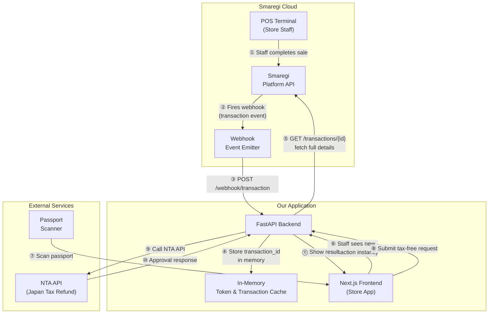
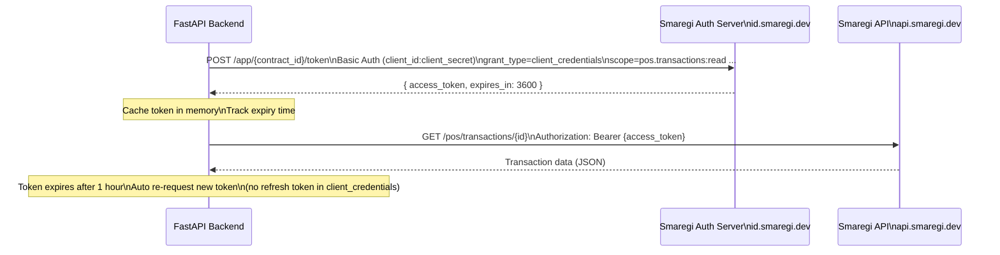
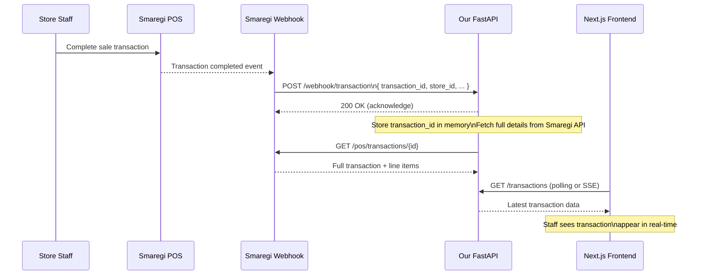
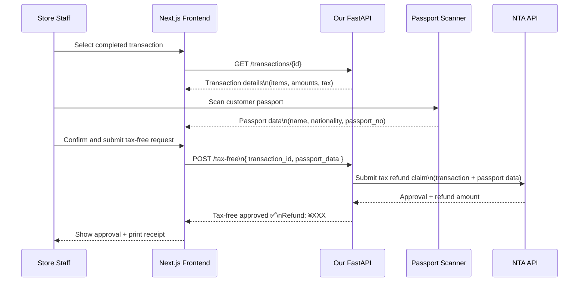

# Smaregi Integration — Tax-Free System

## Overview

This document describes how our Tax-Free application integrates with the Smaregi POS system to enable real-time tax refund processing for foreign tourists in Japan.

---

## System Architecture



---

## Authentication Flow



---

## Real-Time Transaction Flow (Webhook)



---

## Tax-Free Processing Flow



---

## Project Structure

```
project/
├── backend/                        # FastAPI
│   ├── main.py                     # App entry point
│   ├── config.py                   # Env vars (contract_id, client_id, etc.)
│   ├── auth/
│   │   └── smaregi_auth.py         # Token fetch + cache + auto-refresh
│   ├── routes/
│   │   ├── webhook.py              # POST /webhook/transaction
│   │   └── transactions.py         # GET /transactions, GET /transactions/{id}
│   └── services/
│       └── smaregi_client.py       # Smaregi API HTTP client
│
├── frontend/                       # Next.js
│   └── ...
│
└── README.md                       # This file
```

---

## Environment Variables

```env
# Smaregi Sandbox
SMAREGI_CONTRACT_ID=sb_xxxx
SMAREGI_CLIENT_ID=your_client_id
SMAREGI_CLIENT_SECRET=your_client_secret

# Environments
SMAREGI_AUTH_BASE_URL=https://id.smaregi.dev
SMAREGI_API_BASE_URL=https://api.smaregi.dev

# NTA API (Japan Tax Refund)
NTA_API_URL=https://...
NTA_API_KEY=your_nta_api_key
```

---

## API Endpoints (Our Backend)

| Method | Endpoint | Description |
|--------|----------|-------------|
| `POST` | `/webhook/transaction` | Receive real-time transaction event from Smaregi |
| `GET` | `/transactions` | List all received transactions (in-memory) |
| `GET` | `/transactions/{id}` | Fetch full transaction details from Smaregi |
| `POST` | `/tax-free` | Submit tax-free request to NTA API |

---

## Smaregi App Setup Checklist

- [ ] Register account at [developers.smaregi.dev](https://developers.smaregi.dev)
- [ ] Create a **プライベートアプリ** (Private App) as **WEBアプリ** (Web App)
- [ ] Copy `client_id` and `client_secret` from Environment Settings
- [ ] Note sandbox `contract_id` (shown as `sb_xxxx` on dashboard)
- [ ] Enable scopes:
  - [ ] `pos.transactions:read`
  - [ ] `pos.products:read`
  - [ ] `pos.stores:read`
- [ ] Set webhook URL to your ngrok URL + `/webhook/transaction`
- [ ] Install [ngrok](https://ngrok.com) to expose local FastAPI for webhook testing

---

## Key Notes

- **App Access Token** expires in **3,600 seconds (1 hour)** — no refresh token, must re-request
- **Webhook** fires instantly when a POS transaction completes — this is what triggers the tax-free flow
- **Sandbox** (`api.smaregi.dev`) is safe for testing — no real store data affected
- **Production** uses `api.smaregi.jp` and `id.smaregi.jp` — swap via env vars only
