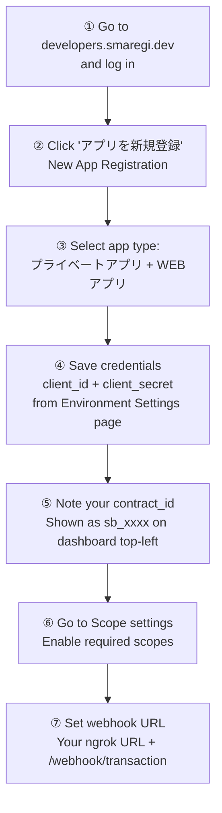
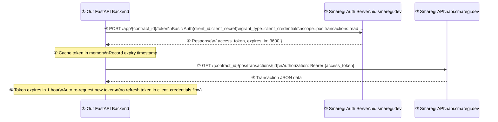
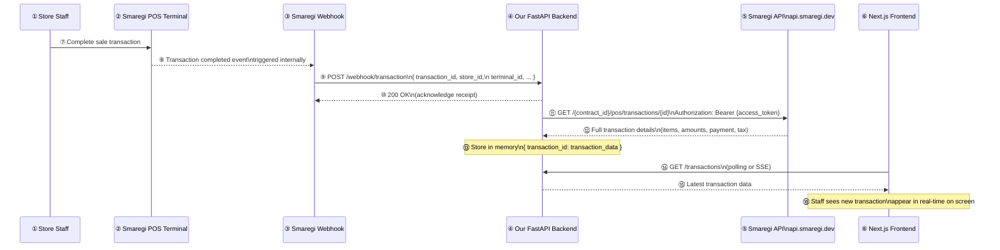

# Smaregi Integration

## Overview

This document describes how our application integrates with the Smaregi POS system to receive real-time transaction data via webhook.

---

## 1. Smaregi App Setup

Before writing any code, you need to create an app in Smaregi Developers and get your credentials.

### Steps



### Required Scopes

| Scope | Purpose |
|-------|---------|
| `pos.transactions:read` | Fetch transaction / order data |
| `pos.products:read` | Fetch product details per line item |
| `pos.stores:read` | Fetch store information |

### Credentials to Save

| Key | Where to Find |
|-----|--------------|
| `client_id` | App → Environment Settings |
| `client_secret` | App → Environment Settings (shown once at creation only) |
| `contract_id` | Dashboard top-left, format: `sb_xxxx` |

> ⚠️ `client_secret` is shown **only once** at app creation. Copy it immediately and store it safely as an environment variable.

---

## 2. Authentication Flow

Our backend uses **OAuth2 Client Credentials** (App Access Token). No user login required — pure server-to-server.



### Token Details

| Property | Value |
|----------|-------|
| Grant Type | `client_credentials` |
| Token Lifetime | `3600` seconds (1 hour) |
| Refresh Token | ❌ Not available — must re-request |
| Auth Method | Basic Auth (`client_id:client_secret` base64 encoded) |
| Sandbox Token URL | `https://id.smaregi.dev/app/{contract_id}/token` |
| Production Token URL | `https://id.smaregi.jp/app/{contract_id}/token` |

---

## 3. Real-Time Transaction Flow (Webhook)

When a staff member completes a sale on the POS, Smaregi fires a webhook to our backend instantly.



---

## 4. Project Structure

```
project/
├── backend/                        # FastAPI
│   ├── main.py                     # App entry point
│   ├── config.py                   # Env vars
│   ├── auth/
│   │   └── smaregi_auth.py         # Token fetch + cache + auto-refresh
│   ├── routes/
│   │   ├── webhook.py              # POST /webhook/transaction
│   │   └── transactions.py         # GET /transactions, GET /transactions/{id}
│   └── services/
│       └── smaregi_client.py       # Smaregi API HTTP client
│
├── frontend/                       # Next.js
│   └── ...
│
└── README.md
```

---

## 5. Our Backend API Endpoints

| Method | Endpoint | Description |
|--------|----------|-------------|
| `POST` | `/webhook/transaction` | Receive real-time transaction event from Smaregi |
| `GET` | `/transactions` | List all received transactions (in-memory) |
| `GET` | `/transactions/{id}` | Fetch full transaction details from Smaregi API |

---

## 6. Environment Variables

```env
# Smaregi Sandbox
SMAREGI_CONTRACT_ID=sb_xxxx
SMAREGI_CLIENT_ID=your_client_id
SMAREGI_CLIENT_SECRET=your_client_secret

# Base URLs (swap for production)
SMAREGI_AUTH_BASE_URL=https://id.smaregi.dev
SMAREGI_API_BASE_URL=https://api.smaregi.dev
```

> For production, change to:
> - `https://id.smaregi.jp`
> - `https://api.smaregi.jp`

---

## 7. Setup Checklist

- [ ] Register account at [developers.smaregi.dev](https://developers.smaregi.dev)
- [ ] Create **プライベートアプリ** (Private) as **WEBアプリ** (Web App)
- [ ] Copy `client_id` and `client_secret` from Environment Settings
- [ ] Note sandbox `contract_id` (`sb_xxxx`) from dashboard
- [ ] Enable scopes: `pos.transactions:read`, `pos.products:read`, `pos.stores:read`
- [ ] Install [ngrok](https://ngrok.com) and expose local FastAPI port
- [ ] Set webhook URL in Smaregi to: `https://your-ngrok-url/webhook/transaction`
