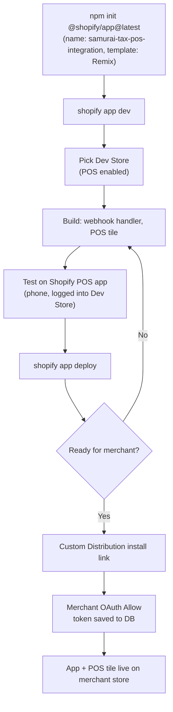

# Shopify App Setup

```mermaid
flowchart TD
    A["npm init @shopify/app@latest\n(name: samurai-tax-pos-integration, template: Remix)"] --> B["shopify app dev"]
    B --> C["Pick Dev Store\n(POS enabled)"]
    C --> D["Build: webhook handler, POS tile"]
    D --> E["Test on Shopify POS app\n(phone, logged into Dev Store)"]
    E --> F["shopify app deploy"]
    F --> G{"Ready for merchant?"}
    G -- No --> D
    G -- Yes --> H["Custom Distribution install link"]
    H --> I["Merchant OAuth Allow\ntoken saved to DB"]
    I --> J["App + POS tile live on merchant store"]
```

