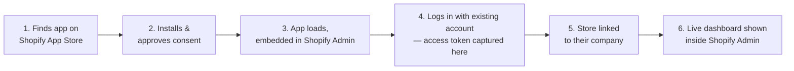
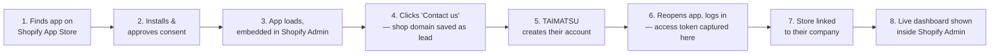
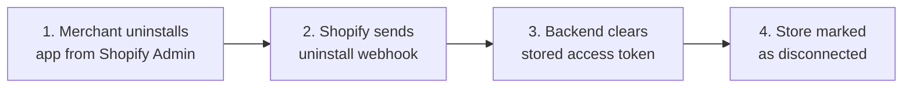

## Existing User (already has SAMURAI TAX account)

```mermaid
flowchart LR
    A[1. Finds app on<br/>Shopify App Store] --> B[2. Installs &<br/>approves consent]
    B --> C[3. App loads,<br/>embedded in Shopify Admin]
    C --> D[4. Logs in with existing account<br/>— access token captured here]
    D --> E[5. Store linked<br/>to their company]
    E --> F[6. Live dashboard shown<br/>inside Shopify Admin]
```

---

## New User (no SAMURAI TAX account yet)

```mermaid
flowchart LR
    A[1. Finds app on<br/>Shopify App Store] --> B[2. Installs &<br/>approves consent]
    B --> C[3. App loads,<br/>embedded in Shopify Admin]
    C --> D[4. Clicks 'Contact us'<br/>— shop domain saved as lead]
    D --> E[5. TAIMATSU<br/>creates their account]
    E --> F[6. Reopens app, logs in<br/>— access token captured here]
    F --> G[7. Store linked<br/>to their company]
    G --> H[8. Live dashboard shown<br/>inside Shopify Admin]
```

---

## Uninstall

```mermaid
flowchart LR
    A[1. Merchant uninstalls<br/>app from Shopify Admin] --> B[2. Shopify sends<br/>uninstall webhook]
    B --> C[3. Backend clears<br/>stored access token]
    C --> D[4. Store marked<br/>as disconnected]
```
