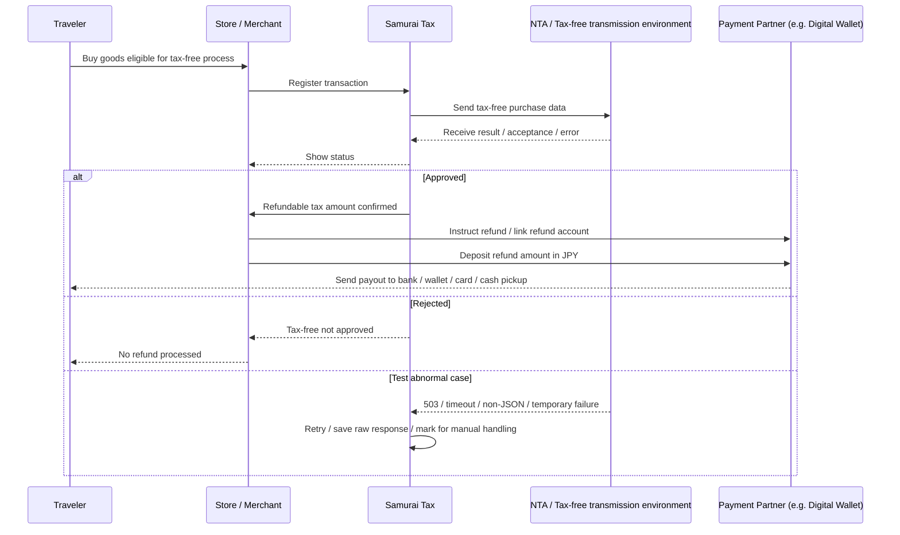

```mermaid
sequenceDiagram
    participant T as Traveler
    participant S as Store / Merchant
    participant Y as Samurai Tax
    participant N as NTA / Tax-free transmission environment
    participant P as Payment Partner (e.g. Digital Wallet)

    T->>S: Buy goods eligible for tax-free process
    S->>Y: Register transaction
    Y->>N: Send tax-free purchase data
    N-->>Y: Receive result / acceptance / error
    Y-->>S: Show status

    alt Approved
        Y->>S: Refundable tax amount confirmed
        S->>P: Instruct refund / link refund account
        S->>P: Deposit refund amount in JPY
        P-->>T: Send payout to bank / wallet / card / cash pickup
    else Rejected
        Y-->>S: Tax-free not approved
        S-->>T: No refund processed
    else Test abnormal case
        N-->>Y: 503 / timeout / non-JSON / temporary failure
        Y->>Y: Retry / save raw response / mark for manual handling
    end

```
